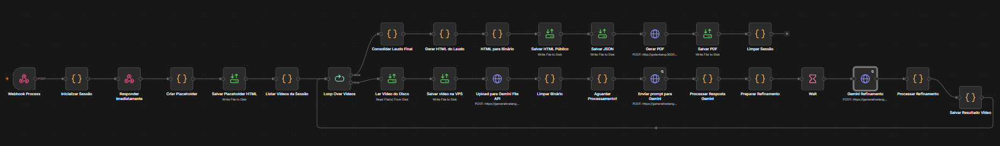
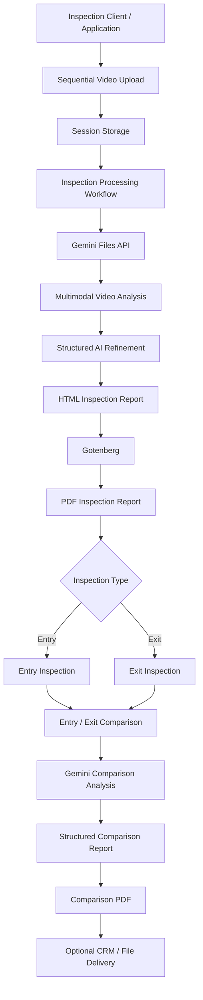
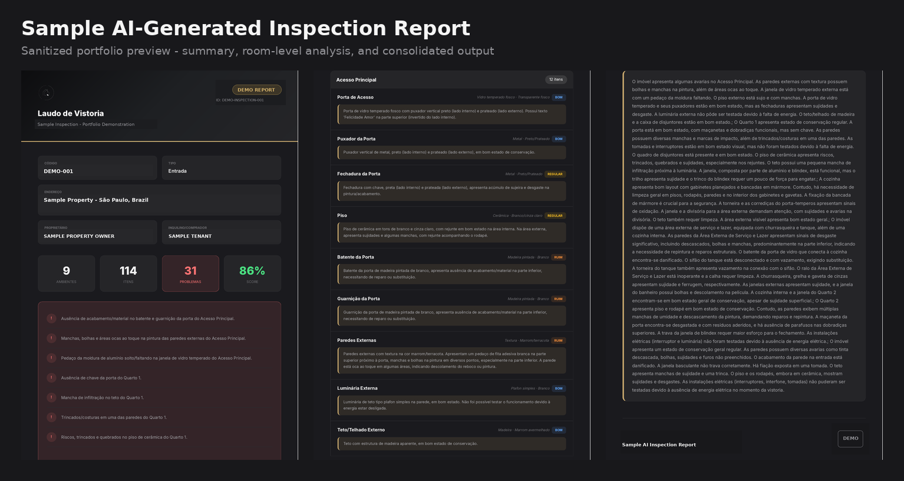

# AI Property Inspection Pipeline

> End-to-end AI-powered property inspection automation built with n8n and Google Gemini, combining multimodal video analysis, structured inspection reporting, PDF generation, and entry/exit comparison.


## Overview

This project demonstrates an automated property inspection pipeline designed to transform inspection videos into structured, AI-assisted property condition reports.

The architecture combines **n8n workflow orchestration**, **Google Gemini multimodal models**, binary file processing, automated HTML/PDF generation, and entry/exit inspection comparison.

The repository contains sanitized versions of the workflows used to demonstrate the system architecture without exposing production credentials, infrastructure, customer information, or internal identifiers.

## Key Features

- **Sequential video ingestion** organized by inspection session
- **Multimodal AI analysis** of property inspection videos
- **Structured property condition extraction**
- **Automated inspection report generation**
- **HTML-to-PDF conversion**
- **Entry vs. exit inspection comparison**
- **AI-assisted damage and condition-change analysis**
- **Webhook-based asynchronous processing**
- **Binary file handling**
- **Optional CRM/file delivery integration**
- **Sanitized and portable n8n workflow exports**

## Workflow Overview

The core inspection-processing workflow orchestrates the complete pipeline from
inspection ingestion to multimodal AI analysis, structured refinement, report
generation, and final document output.

> The screenshot below illustrates the production architecture. Sensitive
> credentials, infrastructure identifiers, URLs, and internal configuration
> have been omitted from the public repository.



## Architecture



## How It Works

### 1. Video Upload

Inspection videos are received sequentially through a webhook and grouped by a unique inspection session.

This allows large inspections to be divided into multiple videos while maintaining the relationship between the media files and the inspection metadata.

### 2. AI Inspection Processing

The processing workflow retrieves the inspection media and sends the videos to the Gemini Files API.

The pipeline then:

1. waits for media processing;
2. performs multimodal property analysis;
3. extracts structured observations;
4. refines the AI output;
5. generates the final inspection report.

### 3. Report Generation

Structured inspection data is transformed into an HTML report and converted to PDF using Gotenberg.

This separates AI analysis from document rendering and makes the reporting layer easier to maintain or replace.

### 4. Entry / Exit Comparison

Two completed inspection reports can be submitted to the comparison workflow.

Gemini analyzes the entry and exit inspections and produces a structured comparison highlighting relevant changes in property condition.

The resulting comparison is then rendered as a separate PDF report.

## Example Output

The pipeline produces a structured inspection report from the processed property inspection media.

The generated document consolidates the AI-assisted analysis into a professional property inspection report, including condition assessments, detected issues, room-level observations, photographic evidence, and an overall property condition summary.

### Sample Inspection Report

The example below is a **sanitized portfolio version** of a report generated by the inspection pipeline.

All names, addresses, identifiers, contact information, QR codes, and other potentially sensitive production data have been removed or replaced with fictional demonstration values.

[](examples/sample-inspection-report.pdf)

**[View the complete sample inspection report (PDF)](examples/sample-inspection-report.pdf)**

### Example Report Output

The generated report demonstrates:

- structured room-by-room property inspection;
- AI-assisted condition classification;
- identification of defects and maintenance issues;
- photographic evidence associated with inspected elements;
- consolidated property condition scoring;
- structured inspection summary;
- professional PDF report generation;
- support for subsequent entry vs. exit inspection comparison.

> **Note:** AI-assisted inspection results are intended to support the inspection workflow and should be reviewed by a qualified professional before being used for legal, contractual, engineering, or property-condition decisions.

## Workflows

### `01-video-upload.json`

Handles sequential inspection video ingestion.

**Responsibilities:**

- receive inspection metadata;
- receive binary video files;
- organize uploads by session;
- persist inspection media for later processing.

### `02-ai-inspection-processing.json`

Core AI processing pipeline.

**Responsibilities:**

- initialize the inspection session;
- upload media to Gemini;
- monitor file processing;
- perform multimodal analysis;
- refine structured results;
- generate the inspection report;
- convert HTML output to PDF;
- clean temporary processing data.

### `03-inspection-comparison.json`

Entry/exit inspection comparison pipeline.

**Responsibilities:**

- receive two inspection reports;
- upload documents for AI analysis;
- compare property conditions;
- structure detected changes;
- generate the comparison report;
- optionally deliver the resulting document to an external system.

## Tech Stack

| Technology | Role |
|---|---|
| **n8n** | Workflow orchestration |
| **Google Gemini** | Multimodal video/document analysis |
| **JavaScript** | Data transformation and workflow logic |
| **Gemini Files API** | Media and document processing |
| **Gotenberg** | HTML-to-PDF conversion |
| **Webhooks** | Pipeline triggers and integrations |
| **Filesystem** | Temporary inspection/session storage |
| **Bitrix24 (optional)** | External CRM/file delivery |

## Repository Structure

```text
ai-property-inspection-pipeline/
│
├── workflows/
│   ├── 01-video-upload.json
│   ├── 02-ai-inspection-processing.json
│   └── 03-inspection-comparison.json
│
├── docs/
│   ├── architecture.md
│   └── security.md
│
├── examples/
│   └── inspection-request.example.json
│
├── .env.example
├── .gitignore
└── README.md
```

## Configuration

The public workflows contain placeholders instead of production secrets.

Example environment configuration:

```env
GEMINI_API_KEY=your_gemini_api_key_here

INSPECTION_BASE_URL=https://inspections.example.com

BITRIX24_PORTAL=YOUR_PORTAL
BITRIX24_USER_ID=YOUR_USER_ID
BITRIX24_WEBHOOK_TOKEN=your_bitrix24_webhook_token_here
```

Never store production credentials directly inside workflow JSON files.

## Importing into n8n

1. Clone or download this repository.
2. Open your n8n instance.
3. Import the JSON files from `workflows/`.
4. Configure your own credentials.
5. Replace deployment-specific placeholders.
6. Configure storage paths and external services.
7. Review webhook authentication and access controls.
8. Test the workflows before activating them.

The workflows included in this repository are intentionally exported as **inactive**.

## Security

This repository contains **sanitized portfolio versions** of the production workflows.

The public exports remove or replace:

- API keys;
- access tokens;
- credential IDs;
- production webhook identifiers;
- private infrastructure URLs;
- n8n instance metadata;
- production workflow identifiers;
- customer information;
- company-specific internal values.

Secrets should be stored using **n8n Credentials** or secure environment variables.

Additional recommendations are available in [`docs/security.md`](docs/security.md).

## Production vs. Portfolio Version

This repository is intended to demonstrate the **architecture, automation design, AI integration, and engineering decisions** behind the system.

Production deployments may include additional infrastructure, monitoring, authentication, business rules, integrations, and operational safeguards that are intentionally excluded from the public version.

## Engineering Highlights

This project demonstrates practical experience with:

- workflow orchestration;
- multimodal AI integration;
- asynchronous API processing;
- REST APIs and webhooks;
- binary media handling;
- prompt-driven structured extraction;
- filesystem/session management;
- automated document generation;
- multi-stage AI pipelines;
- external system integrations;
- security-focused workflow sanitization.

## Disclaimer

AI-assisted inspection results should not be treated as an independent technical, engineering, legal, or contractual assessment.

Generated reports should be reviewed by a qualified professional before being used for decisions involving property condition, liability, contractual obligations, or disputes.
